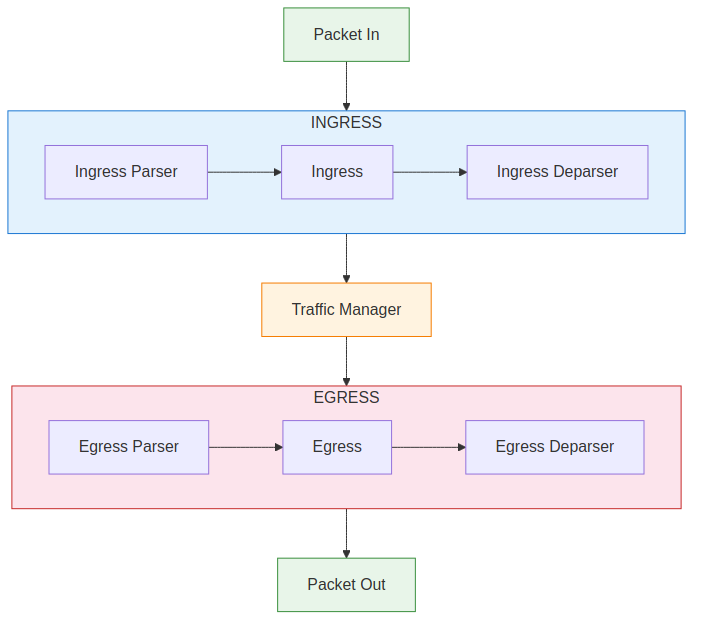
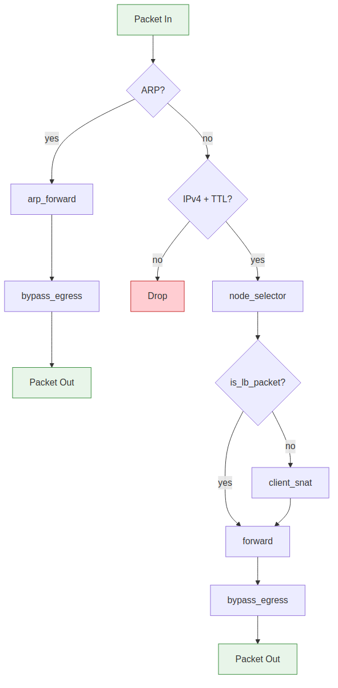
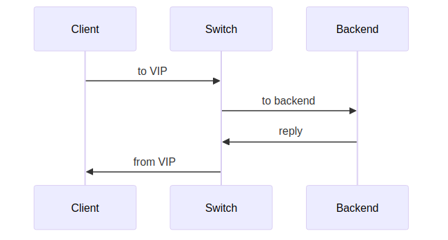
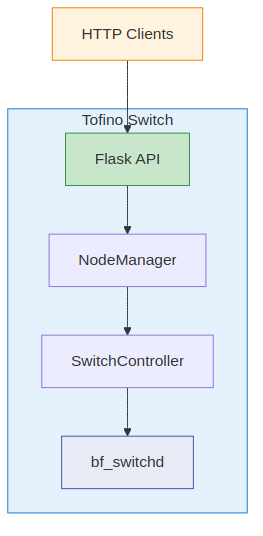
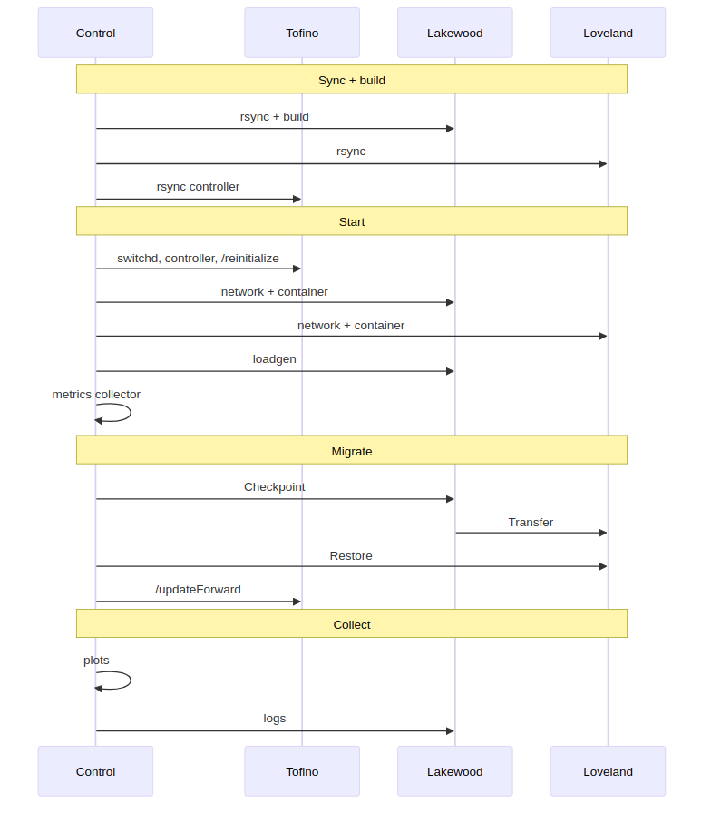

# P4ContainerFlow: Technical Report

P4ContainerFlow is a system for live container migration without dropping TCP connections. It combines a P4-based L3/TCP load balancer running on an Intel Tofino switch with a Python control plane and CRIU (Checkpoint/Restore In Userspace). The load balancer distributes client traffic across backend servers using consistent hashing. When a container needs to migrate, CRIU checkpoints it on the source server and restores it on the destination, while the control plane updates the switch's forwarding tables so that in-flight connections continue seamlessly on the new host. The P4 program, the control plane, and the migration logic all work together to make this transparent to the client.

This document walks through the end-to-end development lifecycle of a P4 program on Intel Tofino hardware using the open-p4studio SDE. It covers everything from spinning up a development VM and compiling the first program, through porting P4 code from BMv2 to real Tofino silicon, to running automated tests on hardware and orchestrating a multi-node experiment. The load balancer described above serves as the running example throughout, but the environment setup, build process, testing patterns, and hardware deployment steps apply to any P4 program targeting Tofino. The goal is to give anyone interested in P4 and programmable data planes a clear picture of what happens at each stage and what problems to expect along the way. The [README](../README.md) covers the commands themselves. The [Experiment Report](experiment_report.md) covers the specific benchmarking methodology and results.

- [P4ContainerFlow: Technical Report](#p4containerflow-technical-report)
  - [Setting Up the Model Environment](#setting-up-the-model-environment)
  - [Porting the P4 Program from V1Model to T2NA](#porting-the-p4-program-from-v1model-to-t2na)
    - [Pipeline Structure](#pipeline-structure)
    - [Metadata and Checksum Handling](#metadata-and-checksum-handling)
    - [Load Balancing and Packet Flow](#load-balancing-and-packet-flow)
  - [Compiling the Program and Exploring the Model](#compiling-the-program-and-exploring-the-model)
  - [Automated Testing on the Model](#automated-testing-on-the-model)
  - [Building for Hardware](#building-for-hardware)
    - [Driver Grafting](#driver-grafting)
    - [The BSP and Hardware Profile](#the-bsp-and-hardware-profile)
    - [Kernel Modules and the CPU Port](#kernel-modules-and-the-cpu-port)
  - [Running and Interacting with Real Hardware](#running-and-interacting-with-real-hardware)
  - [Testing on Hardware](#testing-on-hardware)
  - [Orchestrating a Multi-Node Experiment](#orchestrating-a-multi-node-experiment)
  - [Conclusion](#conclusion)

## Setting Up the Model Environment

The first step is getting the SDE built and a P4 program running on the software model. No hardware is needed at this stage. The model simulates the Tofino ASIC pipeline as a userspace process and accepts the same gRPC calls as the real chip, so everything developed here (the P4 program, the controller, the tests) carries over to hardware without modification.

This project uses open-p4studio (pinned as a Git submodule at commit [`0ec2496`](https://github.com/p4lang/open-p4studio/tree/0ec24969627926cf1c890e560bcc60a21add38a3), SDE version 9.13.4). Open-p4studio is the open-source variant of Intel's P4Studio SDE. It provides the P4 compiler (`p4c-barefoot`), the assembler (`bfas`), the BF Runtime libraries for gRPC-based table management, and `bf_switchd`, the daemon that loads and runs P4 programs. What it does not provide are the proprietary driver sources needed for real hardware, which are covered later in [Building for Hardware](#building-for-hardware).

The SDE build is driven by YAML profiles. A profile declares which components to build: the compiler, gRPC support, thrift, example programs, and optionally hardware-specific packages. The model profile (`profiles/tofino2-model.yaml`) is minimal. It enables the compiler, BF Runtime, gRPC, and thrift. No hardware drivers, no BSP, no SAI. The build is invoked through `p4studio profile apply`, which reads the YAML, resolves dependencies between packages, and builds everything into `$SDE_INSTALL`. This takes a long time and a lot of memory.

One problem that is easy to hit early: open-p4studio depends on `distutils`, a Python standard library module that was removed in Python 3.12. The build fails with an import error that does not mention `distutils` by name, making it hard to diagnose. Ubuntu 22.04 ships Python 3.10, which works. The Vagrantfile pins Ubuntu 22.04 (`ubuntu/jammy64`) for exactly this reason and provisions a VM with 32 GB of RAM (the SDE build is memory-intensive), 10 CPUs, and 50 GB of disk (the build tree is large). The Makefile also validates the Python version before starting the build and prints a clear message if it is too new.

When the build finishes, a helper script (`create-setup-script.sh`) generates a shell script that sets `SDE`, `SDE_INSTALL`, `LD_LIBRARY_PATH`, and `PATH`. Every other tool in the project (the compiler, switchd, the controller, the test runner) assumes these environment variables exist. The Vagrant provisioner adds this script to `.bashrc` so it is sourced automatically on login. After provisioning completes, the VM is ready to compile and run P4 programs.

## Porting the P4 Program from V1Model to T2NA

With the model environment ready, the next question is what P4 program to run. The load balancer at the heart of P4ContainerFlow was originally written for the V1Model architecture (BMv2) in [p4containerflow](https://github.com/stano45/p4containerflow). That version runs on the software switch and handles the core forwarding and SNAT logic, but BMv2 is a software reference model, not a hardware target. Deploying it on a real Tofino 2 ASIC required a full rewrite targeting the Tofino 2 Native Architecture (T2NA). Both architectures use P4-16, but the pipeline structure, available externs, metadata handling, and compiler constraints are quite different. This section walks through those differences and the reasoning behind each change. While specific to a load balancer, the concepts apply broadly to any V1Model-to-Tofino port.

### Pipeline Structure

V1Model defines a single linear pipeline with six programmer-supplied blocks:


T2NA splits the pipeline into two independent halves (ingress and egress), separated by the traffic manager. Each half has its own parser, control block, and deparser. Checksum operations are embedded in the parsers and deparsers rather than being standalone blocks.



Since the load balancer performs all processing in ingress, the egress pipeline is left empty and bypassed using the `BypassEgress()` extern (V1Model has no equivalent):

```c
Pipeline(SwitchIngressParser(),
         SwitchIngress(),
         SwitchIngressDeparser(),
         EmptyEgressParser(),
         EmptyEgress(),
         EmptyEgressDeparser()) pipe;

Switch(pipe) main;
```

The empty egress blocks and `TofinoIngressParser()` come from `common/util.p4`, a shared include from the SDE's example programs. `TofinoIngressParser()` must be called in every parser's `start` state to extract platform-specific intrinsic metadata before any user headers.

### Metadata and Checksum Handling

V1Model provides a single `standard_metadata` struct with fields like `ingress_port`, `egress_spec`, and `packet_length`. Tofino replaces this with four separate intrinsic metadata structs: `ingress_intrinsic_metadata_t` (port, timestamp), `ingress_intrinsic_metadata_from_parser_t` (parser errors), `ingress_intrinsic_metadata_for_deparser_t` (digest, resubmit control), and `ingress_intrinsic_metadata_for_tm_t` (egress port, QoS). The ingress control block signature in T2NA takes all four as parameters.

The program defines its own `metadata_t` struct carrying five fields: `is_lb_packet` (whether the packet matched the load balancer table), `checksum_err_ipv4_igprs` (parser checksum verification result), `checksum_tcp_tmp` (partial TCP checksum deposited by the parser), `checksum_upd_ipv4` and `checksum_upd_tcp` (flags that tell the deparser whether to recompute checksums). These flags are set by actions like `set_rewrite_dst` and `set_rewrite_src` when they modify header fields, so the deparser only recomputes checksums for packets that actually had their addresses changed.

This ties directly into how checksumming works on Tofino. In V1Model, `MyVerifyChecksum` and `MyComputeChecksum` are standalone pipeline stages. On Tofino, checksumming units are only available in the parser and deparser. The rewritten parser verifies the IPv4 checksum by calling `ipv4_checksum.add(hdr.ipv4)` followed by `ipv4_checksum.verify()`. For TCP, it computes a partial checksum by subtracting the fields that might be modified (source and destination addresses) using `tcp_checksum.subtract()`, then deposits the intermediate result into `metadata.checksum_tcp_tmp` via `subtract_all_and_deposit()`. The deparser conditionally recomputes both checksums if the `checksum_upd_*` flags are set, using the deposited partial value to avoid reprocessing the entire TCP payload. This subtract-then-redeposit pattern is the standard Tofino approach for incremental checksum updates: subtract the old values of the mutable fields in the parser, store the residual, and in the deparser add the new values back along with that residual.

### Load Balancing and Packet Flow

V1Model implementations of consistent hashing typically use `hash()` calls inside actions with manual member selection logic. T2NA provides a native `ActionSelector` extern that handles this at the hardware level. The load balancer declares a CRC16 hash, an `ActionProfile` with capacity for four members, and an `ActionSelector` that ties them together in `FAIR` mode:

```c
Hash<bit<16>>(HashAlgorithm_t.CRC16) sel_hash;
ActionProfile(4) action_selector_ap;
ActionSelector(action_selector_ap, sel_hash, SelectorMode_t.FAIR, 4, 1) action_selector;
```

The `node_selector` table uses the five-tuple (source IP, destination IP, protocol, source port, destination port) as selector keys, with the destination address as an exact-match key. The exact-match key identifies the virtual IP, and the selector keys determine which backend member the connection hashes to. The action `set_rewrite_dst` rewrites the destination address and marks the checksum flags described above. `SelectorMode_t.FAIR` distributes traffic evenly across active members. When a member is deactivated (its `$ACTION_MEMBER_STATUS` is set to inactive), traffic is automatically redistributed among the remaining active members. Because the hash is computed on the five-tuple, all packets from the same TCP connection hash to the same member index and go to the same backend server.

Three other tables complete the forwarding logic. The `forward` table maps the rewritten destination to an egress port. The `client_snat` table matches on `hdr.tcp.src_port` (exact) and rewrites the source IP to the VIP for server-to-client replies. The `arp_forward` table matches on `hdr.arp.target_proto_addr` (exact) and sets the egress port for ARP packets. Splitting this across multiple tables means forwarding rules can be updated independently during migration without touching the load balancer logic.

The ingress `apply` block ties these tables together in a specific order:



ARP packets hit `arp_forward`, bypass egress, and return immediately. Invalid IPv4 packets (bad header or TTL below 1) are dropped. Valid IPv4/TCP packets go through `node_selector` (which may rewrite the destination to a backend server), then `client_snat` (which rewrites the source address for server-to-client replies, but only if the packet was not a load-balanced packet), then `forward` (which sets the egress port), and finally `bypass_egress`. Packets with IPv4 checksum errors are tagged by overwriting the destination MAC with `0x0000deadbeef` for debugging purposes rather than being dropped, which makes them easy to identify in packet captures.

A concrete example illustrates the full packet flow through the pipeline:



A client at `10.0.0.100:54321` sends a TCP packet to the VIP `10.0.0.10:8080`. The parser extracts Ethernet, IPv4, and TCP headers and verifies the IPv4 checksum. In ingress, `node_selector` matches on the destination (the VIP), hashes the five-tuple, and selects member 0, whose action rewrites the destination to `10.0.0.2` (the chosen backend). Because this is a load-balanced packet, `client_snat` is skipped. The `forward` table maps the rewritten destination to an egress port, and the deparser recomputes both checksums because the destination address changed. For the return path, the backend responds with its own IP as the source. This time `node_selector` does not match (the destination is the client, not the VIP), so `client_snat` kicks in and rewrites the source from `10.0.0.2` back to the VIP. The client never sees the backend's real IP. From its perspective, every packet comes from `10.0.0.10`. This is what allows CRIU to migrate the container to a different backend without breaking the TCP connection: the control plane updates the ActionSelector member to point to the new server, but the VIP and the five-tuple hash remain unchanged.

At the BF Runtime level, the ActionSelector is programmed through three related tables. The `action_selector_ap` table maps `$ACTION_MEMBER_ID` (an integer index, 0 through 3) to a `set_rewrite_dst` action with the backend's IP address. The `action_selector` table defines a group identified by `$SELECTOR_GROUP_ID`, with `$MAX_GROUP_SIZE` set to 4, and arrays of `$ACTION_MEMBER_ID` and `$ACTION_MEMBER_STATUS` (active or inactive) that control which members participate. The `node_selector` table ties a VIP (exact match on destination address) to this group. When the controller needs to migrate traffic, it modifies the action profile member's destination IP via the `action_selector_ap` table. The group membership and hash remain unchanged, so the member index stays the same and existing connections are not disrupted.

The Tofino compiler enforces hardware constraints that BMv2 does not. Tables must fit into physical pipeline stages. The Packet Header Vector (PHV) has a fixed allocation budget. Hash distribution units are shared resources. Multi-step arithmetic that works on BMv2 may need to be restructured to fit within a single stage or split across stages in a way the compiler can schedule. Some of these constraints only show up during compilation. The P4 source uses conditional compilation (`#if __TARGET_TOFINO__ == 3 ... #elif __TARGET_TOFINO__ == 2 ... #else ... #endif`) to support TNA, T2NA, and T3NA from a single file, selecting the correct platform includes at compile time.

## Compiling the Program and Exploring the Model

With the P4 program written, the next step is compiling it and running it on the model. The P4 compiler (`p4c-barefoot`) reads the P4 source and produces a `.bfa` (Barefoot Assembly) file. The assembler (`bfas`) turns this into `tofino2.bin`, the binary that `switchd` loads into the pipeline at startup. The build also emits `bf-rt.json` (the BF Runtime schema that the controller and `bfrt_python` use to discover tables and their fields), `context.json` (pipeline context for switchd), and `p4info.txt` (P4Runtime metadata). The P4 source depends on shared includes from `common/util.p4` in the SDE's example programs. These are copied into `load_balancer/common/` on the first build. There is no incremental compilation. Any change to the P4 source requires a full rebuild.

Running on the model requires three concurrent processes. The first is `tofino-model` itself, which simulates the ASIC and listens for switchd to connect. The second is `switchd`, which loads the compiled P4 binary, sets up the pipeline, and exposes the gRPC server that clients use to manage tables. The third process is whatever interacts with the pipeline: a test suite, the controller, or an interactive shell session. The model and switchd communicate over TCP. Switchd and any client communicate over gRPC. The model also sets up virtual Ethernet pairs (veths) that PTF tests use to inject and capture packets through the simulated pipeline.

The difference between model and hardware mode comes down to a single field in the switchd JSON configuration: `agent0`. On hardware, this is set to `"lib/libpltfm_mgr.so"`, which loads the platform manager and communicates with the ASIC over PCIe. In the model config, `agent0` is omitted entirely, and switchd connects to `tofino-model` over a local TCP socket instead. Both config files live under `load_balancer/` in this project.

Once switchd is running, `bfrt_python` (launched through `bfshell`) provides an interactive Python shell connected to the gRPC server. This is the best way to get a feel for the pipeline before writing any controller or test code. Tables can be listed, entries inserted or deleted, and the pipeline state inspected interactively. For example, listing the tables shows the five P4 tables (`node_selector`, `action_selector`, `action_selector_ap`, `forward`, `arp_forward`, `client_snat`) plus the system tables like `$PORT`. Entries can be inserted manually to test forwarding behavior. On the model, table names use the `SwitchIngress.*` prefix (e.g., `SwitchIngress.node_selector`). On hardware, they use `pipe.SwitchIngress.*` instead. This prefix difference surfaces in test code and controller code and means table access cannot be shared directly between model and hardware paths.

## Automated Testing on the Model

Once the program compiles and runs correctly on the model through manual interaction, the next step is automated testing. The SDE ships with PTF (Packet Test Framework), a Python-based framework that sends real packets through the simulated pipeline via the virtual Ethernet pairs and verifies the output. The PTF runner (`run_p4_tests.sh`) sets up the veth interfaces, waits for switchd to be ready, and executes test classes that subclass PTF's `BfRuntimeTest`. Each test gets a gRPC connection to switchd, access to the BF Runtime API for table management, and the ability to send and receive packets through the model.

Both test files (`test/model/test_dataplane.py` and `test/model/test_controller.py`) share an `AbstractTest` base class that wraps the BF Runtime boilerplate. PTF's raw API requires constructing `KeyTuple` and `DataTuple` objects, looking up tables by name, and managing insertion order manually. The `AbstractTest` class wraps all of this with helpers like `insertNodeSelectorEntry`, `insertActionTableEntry`, `insertForwardEntry`, and so on, one for each of the five P4 tables. It also handles table cleanup on teardown in reverse insertion order (respecting the referential integrity constraints of the ActionSelector), packet construction using `simple_tcp_packet`, and traffic balance verification with configurable imbalance tolerances. Writing a new test means subclassing `AbstractTest`, calling the table helpers to set up the pipeline state, sending packets, and asserting on the output.

The dataplane tests cover the core forwarding behavior: L3 forwarding between nodes, even traffic distribution across two backends, SNAT for server-to-client replies, ARP forwarding, MAC rewrite on egress, and hairpin routing (where a packet exits the same port it entered). They also test dynamic scenarios: updating an ActionSelector member to point to a new backend and verifying that traffic redistributes correctly, and changing a node's port while keeping its IP the same. Each test sets up only the table entries it needs, sends a batch of packets with varying five-tuples, and checks that the right packets arrive on the right ports with the right header modifications.

The controller integration tests go further. They start the actual controller process, use its HTTP API to trigger migrations (`/migrateNode`, `/reinitialize`), and verify with PTF packet I/O that traffic reaches the correct backend after each migration. This validates the full stack: HTTP request to controller, controller updates BF Runtime tables via gRPC, switchd applies the new pipeline state, and packets are forwarded correctly.

A few challenges with model testing are worth noting. The `$PORT` BF Runtime table (used for physical port configuration on hardware) is not always available in the P4-specific `bfrt_info` on the model. The tests fall back to the global `bfrt_info` and skip gracefully if it is still not found. Hash-based load balancing is inherently variable, so the traffic balance tests allow a tolerance of 20-35% imbalance rather than expecting perfect distribution. And as mentioned above, the `SwitchIngress.*` vs `pipe.SwitchIngress.*` table name difference means the model and hardware tests cannot share table access code directly.

## Building for Hardware

At this point, the P4 program works on the model and has automated tests passing. Moving to real hardware requires rebuilding the SDE with two additional components: the proprietary driver sources and the Board Support Package (BSP). This is the most involved part of the setup, and the most likely to produce confusing errors. The [README](../README.md) covers the commands. This section explains what is happening underneath and what went wrong when we did it.

### Driver Grafting

Open-p4studio ships with stubs for the driver layer, specifically the port manager and serdes interfaces. These stubs compile, but they do not actually talk to hardware. The real implementations contain proprietary IP: the Avago serdes libraries (AAPL), Credo and Alphawave serdes drivers, embedded microprocessor support code, and register access logic for the UMAC and MAC/PCS blocks. To get a working hardware build, the real driver sources from Intel's proprietary SDE archive must be copied into the open-source tree, overwriting the stubs with functional implementations. The open-p4studio documentation calls this "grafting."

The grafting is done by `hw/rdc_setup.sh`, which copies specific files from the proprietary `bf-drivers` into the open-source `pkgsrc/bf-drivers`. This includes the `bf_switchd` entry point, the Avago serdes libraries (`libavago*`, AAPL headers), vendor serdes drivers for Avago, Credo, and Alphawave, microprocessor support (`microp`), and dozens of port manager source files across `port_mgr_tof1/`, `port_mgr_tof2/`, and `port_mgr_tof3/`. An `RDC_README` and the script itself describe the process, but at commit `0ec2496` we were not able to produce a working build by following them directly. The issues described here may be fixed in later versions.

The script ships with hardcoded paths pointing to a specific engineer's NFS home directory (`/nfs/site/home/vtipired/...`). These need to be replaced with local values for `RDC_BFD` and `OS_BFD` before running, and if the paths are incorrect the script exits silently without copying anything. The file list itself is manually maintained and does not track SDE versions, so when we used SDE 9.13.4 some listed files did not exist in the proprietary archive while other files the build needed were missing from the list entirely. Because the `cp` calls are not guarded, missing files are skipped without warning, and the build proceeds until it fails deep in the CMake stage with errors that give no indication of which source file was never copied. The `RDC_README` compounds the problem by listing a different set of files than the script. It references `bf-drivers/src/firmware` (which does not exist in the 9.13.x SDE), contains path typos (`bf-drvers`, `port-mgr`), and omits entries the script does copy, such as `bf_fsm_hdlrs.c` for tof1 and the `aw_4ln` directory for tof3.

### The BSP and Hardware Profile

Beyond bf-drivers, there is the BSP (Board Support Package). The grafting script does not handle it at all. The BSP provides `bf-platforms`, which contains board-specific code for QSFP management, platform detection, LEDs, and fans. It must be extracted separately. Intel ships it as a nested tarball: the outer archive contains an inner `bf-platforms-*.tgz` that extracts to a versioned directory name like `bf-platforms-9.13.4`. The build system expects this directory to be called exactly `bf-platforms`, so it needs to be renamed after extraction.

The hardware build profile also requires fields absent from the model profile: `asic: true`, the BSP path via `bsp-path:`, `bf-platforms` enabled with the correct platform variant (such as `newport` for the Wedge100BF), and SAI support. None of these are filled in by `p4studio profile apply` or the interactive installer. They need to be configured in the profile YAML manually. The project's Makefile automates the full sequence: extracting the SDE, patching the paths in `rdc_setup.sh` by parsing the SDE version from the directory name, running the graft, unwrapping the nested BSP tarball, renaming the extracted directory, injecting the BSP path into the profile YAML via `sed`, and invoking `p4studio profile apply`. Each step validates that expected files and directories exist before proceeding.

### Kernel Modules and the CPU Port

The Tofino ASIC (Application-Specific Integrated Circuit, the actual packet-processing chip on the switch) is accessed through `/dev/fpga0`, which requires the Barefoot kernel modules to be loaded. Three modules are relevant: `bf_kdrv` (the core FPGA driver), `bf_kpkt` (kernel packet path), and `bf_knet` (kernel network interface). After a reboot, these modules are not loaded automatically unless a systemd service has been set up for it. Each module has a load script under `$SDE_INSTALL/bin/`. If `switchd` fails with "device not found," the kernel modules need to be loaded first.

The Tofino also exposes a CPU port (device port 64) accessible via `bf_kpkt` and `veth250`. This port could bridge internet traffic into the P4 data plane, but in our configuration `switchd` skips the packet manager initialization when `bf_kpkt` is loaded, leaving `pkt_extraction_credits` at zero for device port 64. The ASIC can inject packets into the CPU port (TX works), but it cannot extract packets from it (RX is blocked). We did not find a way to resolve this. The experiment uses a macvlan sub-interface on the host as an alternative (see the [Experiment Report](experiment_report.md) for details).

## Running and Interacting with Real Hardware

With the hardware build complete and the kernel modules loaded, running on the real ASIC is structurally similar to the model. The switchd configuration now includes `agent0` pointing to `libpltfm_mgr.so`, which loads the platform manager, initializes the ASIC over PCIe, manages physical optics, and handles board-level functions like fan control and thermal monitoring. From the gRPC API side, everything else looks the same: the same BF Runtime tables, the same controller code, the same `bfrt_python` shell. The one visible difference is that table names on hardware use the `pipe.SwitchIngress.*` prefix (e.g., `pipe.SwitchIngress.node_selector`) rather than `SwitchIngress.*`.

One new concern on hardware is port configuration. Physical ports do not link automatically. Speed, FEC type, and auto-negotiation must be set through the `$PORT` BF Runtime table before a port will come up. Getting these values wrong results in ports that stay down with no error message. The link simply never comes up. The controller handles port configuration automatically on startup based on the `port_setup` array in its JSON configuration file, where each entry specifies a device port number, a speed constant (e.g., `BF_SPEED_25G`), a FEC type (e.g., `BF_FEC_TYP_REED_SOLOMON`), and an auto-negotiation setting.

The control plane is a Python application with three components: a Flask HTTP API (`controller.py`), a BF Runtime switch controller (`bf_switch_controller.py`), and a node manager (`node_manager.py`). It runs on the switch itself and talks to `switchd` over a localhost gRPC connection.



On startup, the controller loads a JSON configuration file that identifies the switch connection (device ID, gRPC address, P4 program name), the load balancer's virtual IP and service port, and a list of backend nodes. The program name is selected based on the `ARCH` environment variable (`tna_load_balancer` for Tofino 1, `t2na_load_balancer` for Tofino 2). The `SwitchController` connects to `switchd` via the `bfrt_grpc.client` library, binds to the P4 pipeline, and configures physical ports. The `NodeManager` then populates all five P4 tables: the ActionSelector group in `node_selector`, one `action_selector_ap` entry per backend, forwarding and ARP entries for every node, and a `client_snat` entry for the service port. These tables have referential dependencies, so cleanup must proceed in reverse insertion order: `node_selector` first, then the group, then the members, and finally the independent tables. Violating this order causes gRPC errors from BF Runtime's referential integrity checks.

The startup script (`controller/run.sh`) constructs a `PYTHONPATH` that includes the SDE's Python libraries (`bfrt_grpc`, `tofino`, `p4testutils`) from their non-standard location under `$SDE_INSTALL`, but filters out the SDE's bundled gRPC package to avoid version conflicts with the controller's own virtual environment (managed by `uv`). If the path is incorrect, the result is typically missing method attributes or protobuf version mismatches at import time.

A few runtime behaviors are worth knowing about. The gRPC channel between the controller and switchd goes stale when switchd is restarted, requiring a controller restart as well. The experiment automation detects this by checking a `$SWITCHD_FRESH` flag. `bfrt_python` sometimes does not display the loaded program after connecting, and restarting `bfshell` resolves the issue. The program name in the configuration file must match `p4_name` exactly. A mismatch results in silent failures when the controller tries to access tables.

The controller exposes its functionality over six HTTP endpoints. The two primary ones are `POST /migrateNode`, which takes `old_ipv4` and `new_ipv4` and updates the action profile member and forwarding entries to point to the new server, and `POST /updateForward`, which updates only the forwarding and ARP tables for a given `ipv4` and `sw_port`. The latter is used for same-IP migration where only the physical port changes. `POST /addForward` inserts a new forwarding entry, and `POST /deleteClientSnat` removes the SNAT entry for the service port, which is necessary during same-IP migration to prevent the SNAT rule from rewriting the source address to the VIP (which would cause the client's TCP stack to reject the packet). `POST /cleanup` and `POST /reinitialize` handle teardown and full re-insertion from the original configuration, respectively.

## Testing on Hardware

The model tests use PTF, which sends packets through virtual Ethernet pairs. Those veths only exist in the model environment. On real hardware there is nothing to inject packets into from userspace, so the testing approach changes fundamentally. The hardware tests use pytest and focus on the control path: they connect to switchd over gRPC, exercise the BF Runtime API, and verify that tables can be written, read, and deleted correctly. Actual data-plane verification requires physical cables and manual observation.

The dataplane tests (`test/hardware/test_dataplane.py`) connect directly to switchd, bind the P4 program, and work through a progression: verify the gRPC connection, confirm that all expected P4 tables exist, write and read entries in the `forward` and `arp_forward` tables, set up the full load balancer pipeline (ActionSelector group, profile members, node selector, SNAT), and configure physical ports through the `$PORT` table. Each test validates that BF Runtime accepts the operations and returns the expected state.

The test infrastructure is built around pytest fixtures defined in `conftest.py`. The `switch_connection` fixture establishes a gRPC connection to switchd, binds the P4 program, and yields a dictionary with the interface, target, and `bfrt_info` objects. It tears down the gRPC stream on cleanup so that the controller can bind afterward. Other fixtures provide an `APIClient` for the controller's HTTP endpoints and config-derived data about nodes and ports. The `$PORT` table access has the same fallback logic as the model tests: try the P4-specific `bfrt_info` first, fall back to the global `bfrt_info` if the table is not found.

The controller API tests (`test/hardware/test_controller.py`) validate the HTTP endpoints: health checks, valid and invalid migrations, response time bounds (migration should complete in under 2 seconds), cleanup, and reinitialization. These require the controller to be running, which creates a mutual exclusion problem. Switchd allows only one gRPC client to bind the P4 program at a time. The dataplane tests bind it directly, so the controller must be stopped. The controller tests need the controller running (which binds the program itself), so the dataplane tests must not be running. The test runner script (`test/hardware/run.sh`) handles this by accepting either `dataplane` or `controller` as an argument and constructing the appropriate `PYTHONPATH` for each. It uses `uv` to manage a test-specific virtual environment and injects the SDE's Python libraries only for dataplane tests, keeping the controller tests isolated.

Manual verification complements the automated tests. With physical cables connected, ARP resolution, ping, and packet captures on the connected servers confirm that the data plane is working end to end. This is the only way to validate that the full path (physical port, serdes link, ASIC pipeline, egress port, cable, server NIC) is functioning correctly.

## Orchestrating a Multi-Node Experiment

With the program tested on both model and hardware, the final challenge is running a real experiment. This means coordinating many components across multiple machines at once: switchd and the controller on the Tofino switch, containers and networking on two servers, a load generator, a metrics collector, and CRIU for live migration. These all run on different machines and must be started, health-checked, and torn down in a specific order. The [Experiment Report](experiment_report.md) describes the specific workload, migration procedure, and results. This section covers the general orchestration patterns we found useful, which apply to any multi-node experiment on this kind of testbed.



The experiment configuration is split into two layers: a base config (`experiments/config.env`) with IP addresses, ports, container images, and application parameters, and a hardware-specific overlay (`experiments/config_hw.env`, created by copying `config_hw.env.example`) that adds SSH targets, NIC names, direct-link IPs, and remote project paths. The overlay sources the base config and overrides what needs to change for the lab environment. This keeps the base config portable and the hardware-specific details in one place.

Remote commands are wrapped in thin shell functions (`on_lakewood`, `on_loveland`, `on_tofino`) that handle SSH connection options and error propagation. This keeps the main orchestration script readable and avoids repeating SSH flags everywhere. The same pattern is used for file transfers: `rsync` pushes the experiment scripts and controller code to the lab machines before each run.

Before starting the experiment proper, the orchestrator waits for each component to be ready. It checks whether switchd is running (polling for the process), waits for the controller's HTTP endpoint to return 200, and verifies the server container's `/health` endpoint through the network. Only after all three report healthy does the experiment proceed to the measurement phase. Skipping these gates leads to races where the load generator starts before the pipeline is fully programmed, producing confusing results. If switchd was freshly started, the orchestrator also restarts the controller, because the gRPC channel goes stale when switchd restarts.

Cleanup is handled by a `trap ... EXIT` handler that kills all background processes (load generator, collector, SSH tunnels), collects logs from remote machines, and writes an error log if the exit was non-zero. This ensures that a failed run does not leave orphaned processes on remote machines. Each run writes its results to a timestamped directory (`results/run_YYYYMMDD_HHMMSS/`), so runs never overwrite each other and old results are always available for comparison.

The data path and the metrics path are deliberately separated. The load generator talks to the server directly through the P4 switch (the actual path being measured), while the metrics collector scrapes endpoints through SSH tunnels from a separate control machine. This ensures that metrics collection does not interfere with the measurements and that the control machine does not need to be on the container subnet.

One subtle issue we discovered is TCP retransmission timeout (RTO) backoff after migration. During a CRIU migration, the server container is frozen for several seconds. Both the load generator's and the server's TCP stacks detect packet loss and begin exponential backoff of their retransmit timers. By the time the container is restored and the switch updated, the kernel's RTO has grown to several seconds. Neither side transmits on the wire until the next RTO fires, which can take 15 to 30 seconds after migration completes. The result is that TCP connections survive (CRIU preserved the socket state), but the application sees no data flow for an extended period, even though both sides are alive and the network path is functional.

The fix is to set an aggressive `rto_min` on the routes used by the data path. During experiment setup (`build_hw.sh`), both the macvlan-shim route on the load generator host and the container's internal route are configured with `rto_min 5ms`. After each migration, `cr_hw.sh` sets the same `rto_min` on the recreated macvlan route inside the restored container and flushes the TCP metrics cache on both endpoints. This bounds the exponential backoff: even after several retransmit doublings, the RTO stays low enough that the next retransmit fires within 1 to 2 seconds of the path becoming available, rather than 15 to 30 seconds. The load generator also sets TCP keepalive with a 1-second interval on its WebSocket connections, providing an additional mechanism for fast connection recovery.

## Conclusion

Working with Intel Tofino hardware through the open-p4studio SDE is a process with many moving parts. The boundary between open-source and proprietary code, the differences between model and hardware behavior, and the constraints of the Tofino compiler all require patience and careful attention. We hope this document saves anyone working with these tools some of the time we spent figuring things out.
